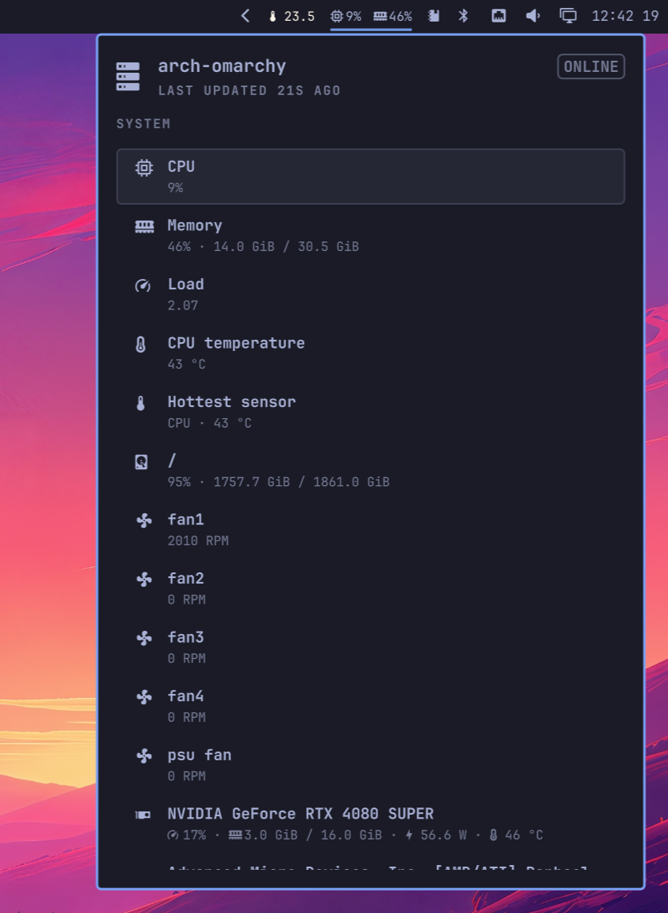

# System Bridge for Omarchy

An Omarchy bar widget and panel for local System Bridge health data. It shows
CPU and memory usage in the bar, with disk, fan, GPU, temperature, uptime, and
reboot details in a keyboard-filterable panel.



## Requirements

- Omarchy Quattro
- [System Bridge installed](https://system-bridge.timmo.dev/install/) with the
  `system-bridge` executable available on `PATH`
- A running local System Bridge service
- `zenity` for the exit confirmation prompt

## Install

Review the repository, then add the plugin:

```bash
omarchy plugin add https://github.com/timmo001/omarchy-system-bridge.git
```

Accept the prompt to enable the plugin during installation.

For an unattended install from a repository you already trust:

```bash
omarchy plugin add \
  https://github.com/timmo001/omarchy-system-bridge.git \
  --enable --yes
```

## Use

Select the widget to open its panel. Type to filter the available readings,
use Up and Down to move through the list, and press Escape to clear the filter
or close the panel. Click a reading or press Enter to run its configured action.
Readings without an action remain informational.

The **System Bridge** heading has two icons: the settings cog opens the web
client's General Settings, and the exit icon asks for confirmation before
stopping System Bridge. Both actions are also available with Up/Down and Enter.
These controls use `system-bridge client open --settings` and
`system-bridge client quit` and need a System Bridge version with those commands.

The plugin exposes the `timmo.system-bridge` shell IPC target with `open`,
`close`, `show`, `hide`, and `toggle` methods:

```bash
omarchy-shell shell toggle timmo.system-bridge
```

## Settings

- `primaryOnly`: show the widget only on the selected output
- `primaryOutput`: optional output name used when `primaryOnly` is enabled;
  the first available output is used when this is empty or unavailable
- `itemActions`: map of reading keys to commands, with each command written as
  an array containing the executable followed by its arguments; defaults to `{}`

### Item actions

Set actions on the `timmo.system-bridge` entry in `shell.json`, or use
`omarchy bar set`. This example opens CPU and memory actions in Herdr and sends
a notification when selecting uptime. Replace the repository label and absolute
directory with your chosen repository:

```bash
omarchy bar set timmo.system-bridge itemActions '{
  "cpu": [
    "dot", "herdr", "repo-open",
    "<repository-label>", "<repository-directory>", "Btop", "btop"
  ],
  "memory": [
    "dot", "herdr", "repo-open",
    "<repository-label>", "<repository-directory>", "Btop", "btop"
  ],
  "uptime": ["notify-send", "System Bridge", "Uptime selected"]
}' --json
```

This replaces the complete action map. Clear all actions with:

```bash
omarchy bar set timmo.system-bridge itemActions '{}' --json
```

Available keys:

| Key | Reading |
| --- | --- |
| `cpu` | CPU usage |
| `memory` | Memory usage |
| `load` | CPU load |
| `cpu-temperature` | CPU temperature |
| `hottest-sensor` | Hottest temperature sensor |
| `disk-root` | Root filesystem usage |
| `fan-<key>` | Individual fan, using its System Bridge `key` |
| `gpu-<id>` | Individual GPU, using its System Bridge `id` |
| `uptime` | System uptime |
| `pending-reboot` | Pending reboot status |

GPUs without an ID use their zero-based array index; those keys depend on device
ordering. Actions apply only to readings present in the panel.

Arguments are passed literally, including spaces and shell metacharacters.
Use an absolute repository directory; `~` and environment variables are not
expanded in arguments. To use shell syntax in an action, invoke a shell
explicitly, for example `["bash", "-lc", "your shell command"]`.

The Herdr example uses the existing
[`dot herdr repo-open`](https://dotfiles.timmo.dev/dot/commands/) command. It
requires `dot`, a running shared Herdr server, and `btop` available in the target
shell. The command resolves the workspace label from the repository picker cache
when available, opens or focuses the repository workspace, and runs the final
command argument in its shell. Each activation opens a new command tab, using
the initial tab when creating a workspace.

For dotfiles-managed configuration, put the map in `settings.itemActions` or
the relevant host settings in the private `omarchy-plugins.json`, then run
`dot stow`. A private plugin entry replaces the matching public entry, so retain
its placement and other settings. Keep personal repository labels and paths in
that private configuration.

An omitted key, `null`, or an empty array leaves the reading without an action.
Malformed maps and commands, non-string arguments, and blank executable names
are ignored. A valid action closes the panel before launching. Actions run
detached; the panel does not report their completion or exit status.

## Update

Review and apply the next fast-forward update:

```bash
omarchy plugin update timmo.system-bridge
```

## Remove

```bash
omarchy plugin remove timmo.system-bridge
```

## Validate from source

```bash
omarchy plugin validate .
```

## Security

This plugin runs unsandboxed inside `omarchy-shell` when enabled. Review its
source before installing it.

The plugin starts one long-running local data process:

```text
system-bridge client data watch \
  --module cpu --module memory --module disks --module sensors \
  --module gpus --module system --module battery
```

It reads System Bridge settings and its local authentication token through the
System Bridge client. Configured item actions launch additional local processes
with the user's permissions. What those commands do depends on the actions you
configure.
